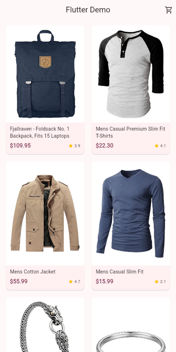
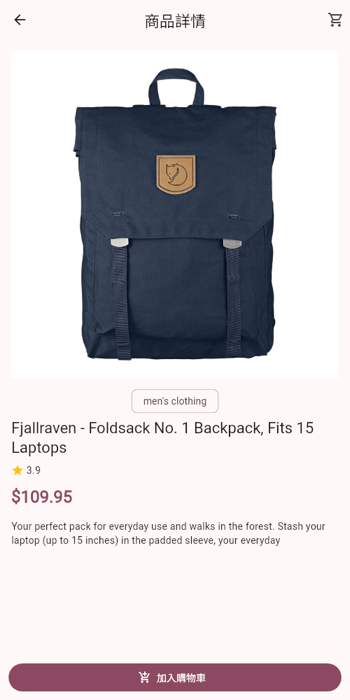
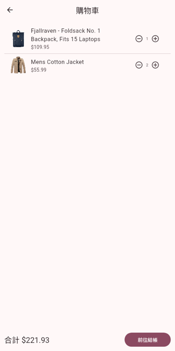
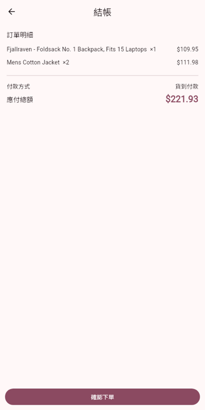

# Flutter Demo — 電商購物流程

用 Flutter 實作的電商 App 範例，涵蓋完整購物流程：**商品列表 → 商品詳情 → 購物車 → 結帳**。商品資料來自公開 REST API [Fake Store API](https://fakestoreapi.com)。

| 首頁 | 商品詳情 | 購物車 | 結帳 |
| :---: | :---: | :---: | :---: |
|  |  |  |  |

## 功能

- **商品列表**：響應式 Grid（依螢幕寬度自動調整欄數）、下拉重新整理、載入中 / 錯誤狀態與重試
- **商品詳情**：圖片、分類、評分、價格、描述，一鍵加入購物車（SnackBar 可直接跳轉購物車）
- **購物車**：增減數量、數量歸零自動移除、即時合計；App Bar 購物車圖示顯示件數 Badge
- **結帳**：訂單明細與總額，模擬送出訂單（loading 狀態、成功對話框、清空購物車）

## 技術棧

| 項目 | 選用 |
| --- | --- |
| UI | Flutter · Material 3 |
| 狀態管理 | [Riverpod 3](https://riverpod.dev)（`Notifier` / `FutureProvider`） |
| 路由 | [go_router](https://pub.dev/packages/go_router) |
| 網路 | [Dio](https://pub.dev/packages/dio) |
| 測試 | flutter_test（Widget test + 購物車邏輯單元測試） |

## 專案結構

```
lib/
├── main.dart              # App 進入點、主題設定
├── router.dart            # 路由定義
├── data/api.dart          # Dio client 與商品資料 Provider
├── models/product.dart    # 商品資料模型
├── state/cart.dart        # 購物車狀態（CartNotifier）與衍生 Provider
├── pages/                 # 首頁、商品詳情、購物車、結帳
└── widgets/               # 共用元件（購物車按鈕、錯誤畫面、商品圖片）
```

## 執行方式

需要 Flutter SDK（Dart `^3.12.2`）。

```bash
flutter pub get
flutter run            # 選擇模擬器、實機或 Chrome
```

執行測試與靜態分析：

```bash
flutter test
flutter analyze
```

## 備註

- 結帳為模擬流程，不會實際送出訂單。
- 商品資料來自第三方公開 API，網路不通時首頁與商品頁會顯示錯誤畫面並可重試。
